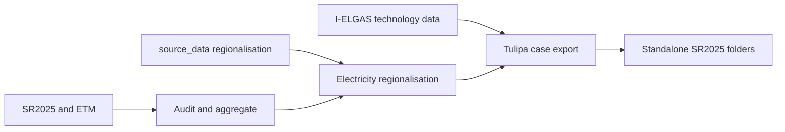
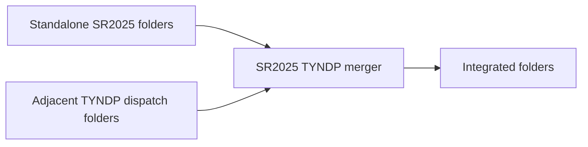

# Pipeline architecture and cleanup status

## Products

The project has two deliberately separate products.

### 1. Standalone SR2025

`output/tulipa/<scenario>_<year>/` contains the Dutch dispatch data derived from
SR2025, ETM, regionalisation sources, and I-ELGAS technology data. This product
must remain buildable and reviewable without TYNDP.



### 2. SR2025 with surrounding TYNDP countries

The adjacent `TYNDP-26-to-Tulipa` repository owns conversion of ENTSO-E source
data. This repository owns only the merge boundary: remove TYNDP's Dutch local
system, retain surrounding countries and approved cross-border transport, then
insert the standalone SR2025 Dutch system.



Do not copy the TYNDP scripts into this repository. Keep both repositories next
to each other and pass `--tyndp-root` when the default adjacent path is not
appropriate.

## Integration contract

The merger currently expects:

- Tulipa schema v0.22 in both products;
- core asset and flow CSVs with identical column order;
- TYNDP output folders configured by model year in
  `config/tyndp_integration_years.csv`;
- Dutch TYNDP asset names beginning with `NL`;
- foreign electricity buses matching the aliases in
  `config/tyndp_electricity_boundary_nodes.csv`;
- optional profile/time tables that can be relabelled from source year to model
  year;
- dispatch-only fixed-capacity data, not an investment snapshot.

Run the merge with:

```powershell
.\.venv\Scripts\sr2025-tyndp-integrate.exe --all `
    --tyndp-root ..\TYNDP-26-to-Tulipa
```

Each output includes `integration-manifest.json` with source paths,
fingerprints, removed rows, retained boundary flows, and copied optional tables.

To reuse an arbitrary fixed-capacity TYNDP run without renaming it or changing
the year mapping, merge one case with `--tyndp-case-dir` and, when needed,
`--tyndp-source-year`. Rebuild the SR case first with
`--renewable-profile-input` pointing to the same folder, so Dutch and European
VRE profiles share one TYNDP dispatch provenance. Investment-enabled folders
are rejected.

## Established carrier boundaries

SR2025 already provides the Dutch electricity interconnector links. The merge
replaces their temporary country endpoint assets with these TYNDP buses:

| SR endpoint | TYNDP bus | Dutch E-nodes in the current source |
| --- | --- | --- |
| Belgium | `BE00_E_Demand_<year>` | `E-MBT`, `E-RIL` |
| Germany | `DE00_E_Demand_<year>` | `E-HGL`, `E-MBT`, `E-MEE` |
| Denmark West | `DKW1_E_Demand_<year>` | `E-EEM` |
| Great Britain | `UK00_E_Demand_<year>` | `E-MVL` |
| Norway South | `NOS2_E_Demand_<year>` | `E-EEM` |

TYNDP's own Dutch electricity node and its international electricity flows are
removed to avoid a parallel Dutch electricity system. Hydrogen transport flows
touching TYNDP NL are rewired to `NL_H_Demand_<year>` and methane transport
flows to `NL_M_Demand_<year>`. Surrounding-country assets and links are kept.

The newest explicit fixed-capacity dispatch folder inspected on 15 September
2026 was `tulipa_input_north_sea_2026_dispatch`: scenario NT, model year 2040,
built 19 August 2026, with `investment: False`. It was used to create
`output/joint-tyndp-dispatch/koersvaste_middenweg_2040`.

## Cleanup findings

### Required before calling the SR2025 build reproducible

1. Implement the missing producers for
   `output/audit/electricity_capacity_all_scenarios.csv` and
   `output/audit/hydrogen_capacity_all_scenarios.csv`. The repository currently
   consumes these files but contains no code that creates them.
2. Extend or replace the dashboard so one command runs both electricity and
   hydrogen capacity aggregation, electricity regionalisation, all 17 Tulipa
   exports, and validation. Its current `capacities` stage runs only the default
   electricity aggregation.
3. Record source provenance for the SR2025 municipality/province workbooks and
  `source_data/i_elgas/Electricity Trading Capacities I-ELGAS.xlsx`.
4. Establish a common currency-year policy. TYNDP costs are real 2024 EUR; the
  price year of `source_data/i_elgas/I-ELGAS_Technology_Data.csv` is not yet recorded.
5. Add a clean-room test which starts without `output/` and proves all
   standalone deliverables can be rebuilt.

### Active modules that should be retained

- `profile_audit.py` is a provenance/review tool; it is not the canonical
  profile builder.
- `electricity_regionalisation.py` is an active standalone stage and a helper
  used by the Tulipa exporter. Its CLI should remain until orchestration absorbs
  it.
- `tyndp_integration.py` is the active optional merger and is exposed as
  `sr2025-tyndp-integrate`.
- `storage_query_inventory.md` records technical source decisions and should be
  linked from future model-method documentation.

### Repository and output policy

- The accidental `%LOCALAPPDATA%/` tree and disposable validation outputs were
  removed during repository cleanup.
- Generated `output/` products remain ignored. Current canonical and integrated
  outputs may be retained locally or distributed separately as archives; they
  are not source-controlled.
- Active SR2025 and I-ELGAS source files are committed. Excel workbooks are
  stored through Git LFS according to `.gitattributes`.
- `source_data/regionalisation/` and `source_data/i_elgas/` are
  source inputs. Their licensing and redistribution status must be explicit
  before publication.

## TYNDP Copilot handoff prompt

Use the following prompt in the Copilot session working on the adjacent TYNDP
repository:

> We are integrating the dispatch-data product of this TYNDP 2026 pipeline with
> the adjacent `SR2025-to-Tulipa` repository. Please inspect this repository and
> prepare an integration handoff, without copying code between repositories.
> Confirm the exact command and environment variables needed to build
> dispatch-only Tulipa v0.22 folders for 2030, 2035, 2040, and 2050. Confirm the
> resulting folder names, schema/table list, optional profile and representative
> period tables, naming convention for Dutch assets and country electricity,
> hydrogen, and methane buses, and all cross-border flows touching NL. Identify
> whether the central scenario is NT/central for each year and explain any year
> substitutions. Report cost currency year, CO2 treatment, fuel-price treatment,
> capacity basis for converters, and any must-run or storage conventions that
> the SR2025 merger must preserve. Compare these facts with the integration
> contract in `../SR2025-to-Tulipa/docs/pipeline_architecture.md`. Flag contract
> mismatches and propose the smallest interface changes, but do not modify the
> SR2025 repository. Return a concise machine-readable contract table plus the
> recommended build commands.
