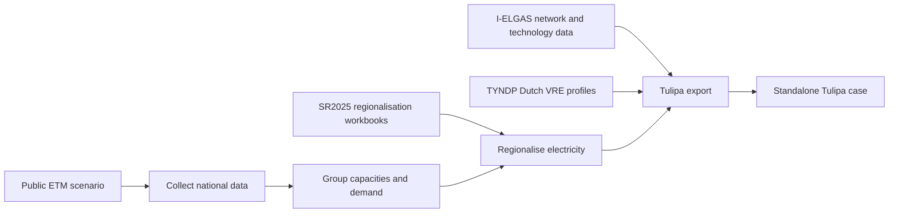

# Pipeline architecture

## Standalone scenario build

`sr2025-build <scenario_key> <year>` owns the complete Dutch build path.



The build selects one enabled row from `config/scenarios.csv`, verifies its
public ETM identity, and writes only the intermediate data consumed by later
stages. Generated files stay under ignored `output/` directories.

The final model boundary is:

- electricity demand, generation, and storage on regional `E-xxx` buses;
- hydrogen and methane demand on national buses;
- fuel-to-power converters between national fuel buses and regional electricity
  buses;
- fixed dispatch capacity with no investment decisions;
- methane fuel cost upstream and residual converter costs downstream, avoiding
  fuel and CO2 double counting.

Dutch wind, solar, and run-of-river profiles come from a fixed-capacity TYNDP
dispatch folder so standalone and integrated cases use the same PECD weather
source.

## Regionalisation inputs

Every build reads:

- `source_data/regionalisation/Regionalisering vraag SR2025.xlsx`;
- `source_data/regionalisation/municipality_node_overrides.csv`;
- the scenario workbook selected by scenario name and reference year.

The 2025 case uses the corresponding 2030 scenario workbook. Across the full
configured registry, all 16 scenario workbooks are active. Historical generated
`Regionalisation_*.xlsx` factor files are not inputs.

## TYNDP integration contract

The optional `sr2025-tyndp-integrate` command combines a standalone SR2025 case
with a dispatch-only folder produced by the adjacent `TYNDP-26-to-Tulipa`
repository. It expects:

- Tulipa v0.22-compatible core CSV schemas;
- fixed-capacity TYNDP inputs with investment disabled;
- Dutch TYNDP assets beginning with `NL`;
- foreign buses matching `config/tyndp_electricity_boundary_nodes.csv`;
- optional profile and representative-period tables that can be relabelled to
  the SR2025 model year.

The merger removes TYNDP's parallel Dutch electricity system, rewires hydrogen
and methane links to the SR2025 national buses, and retains surrounding-country
assets and approved international links. Each merged output contains an
`integration-manifest.json` with source paths and fingerprints.

Configured all-year integration:

```powershell
.\.venv\Scripts\sr2025-tyndp-integrate.exe --all `
    --tyndp-root ..\TYNDP-26-to-Tulipa
```

For one arbitrary fixed-capacity folder, use `--tyndp-case-dir` and optionally
`--tyndp-source-year`. Build the SR2025 case with VRE profiles from that same
folder before merging it.
